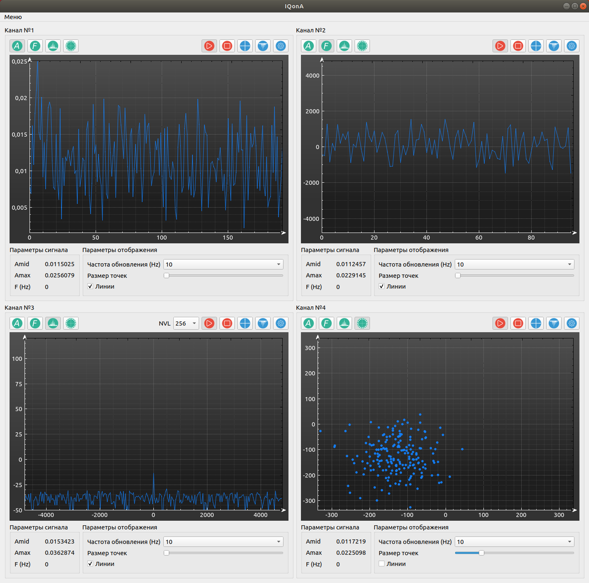

# IQonA

IQonA - инструмент для анализа и визуализации потока IQ отсчётов, принимаемого по
Ethernet посредством протокола UDP.

------------------------------------------------------------------
### Описание
------------------------------------------------------------------

Приложение позволяет создавать до 4-х каналов анализа и визуализации
сигналов. Данные принимаются по Ethernet из указанного в настройках
UDP порта с любого заданного номера байта в пакете. Приложение 
поддерживает три формата отсчётов IQ:
 * UINT8  - 8-ми битные части I и Q формата  I0  Q0
 * UINT16 - 16-ти битные части I и Q формата I0  I1  Q0  Q1
 * PCM24  - 24-х битные части I и Q формата  I1  I2  Q1  Q2  I0  Q0

IQonA осуществляет визуализацию следующих параметров сигнала:
 * амплитуды;
 * частоты;
 * спектра;
 * созвездия.

В режиме отображения спектра предусмотрена возможность выбора его разрешения
(по какому количеству точек будет производиться преобразование Фурье),
обозначенная в приложении как "NVL".

Визуализация произодится методом построения графика по точкам на
на основании принятых пакетов с отсчётами IQ, а также методом отображения
изменения сигнала во времени ("водопад").

-------------------------------------------------- ----------------
### Ubuntu Linux
-------------------------------------------------- ----------------

Текущая версия разработана под Ubuntu 18.04. Создание исполняемого
файла под Ubuntu (16.04 или новее) предполагает следующие этапы.

1. Загрузка дерева исходных текстов
 (предполагается, что у вас установлен клиент git и cmake).

 * git clone https://github.com/DmitriyHook/IQonA

2. Установка необходимых пакетов

 * sudo apt-get update
 * sudo apt-get install qt5-qmake build-essential g++
 * sudo apt-get libfftw3-dev

3.  Сборка и запуск.

 * mkdir build
 * cd build
 * qmake ../IQonA/IQonA.pro -spec linux-g++
 * make
 * make clean
 * ./IQonA

-------------------------------------------------- -----------------------
### История
-------------------------------------------------- -----------------------

Приложение создавалось для:
 * отладки 4-х канального КВ радиоприёмника, управляемого через Ethernet и
 отправляющего отсчёты IQ со скоростью 9600/с в формате PCM24;
 * отладки цифрового модема с поддержкой нескольких классов излучения и 
 генерирующего отсчёты IQ с той же скоростью и в формате UINT16;

Также инструмент был проверен в работе с SDR приёмником на базе чипа R820T, в
связке с дополнительным ПО, обеспечивающим ретрансляцию потока из USB в Ethernet.

# Copyright

     Copyright (C) 2020
     Dmitriy Kryukov (dmitriy.hook@gmail.com)

     Программное обеспечение IQonA доступно под лицензией GPL-3.0.
     Подробнее см. GNU General Public License.

# IQonA
